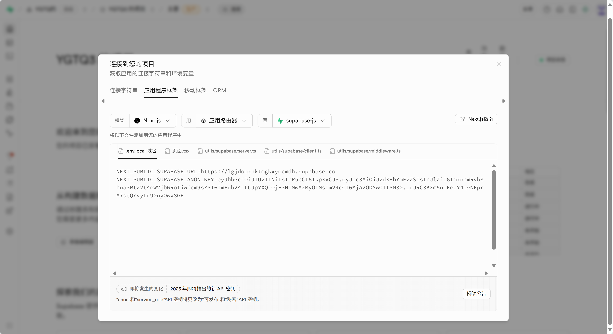
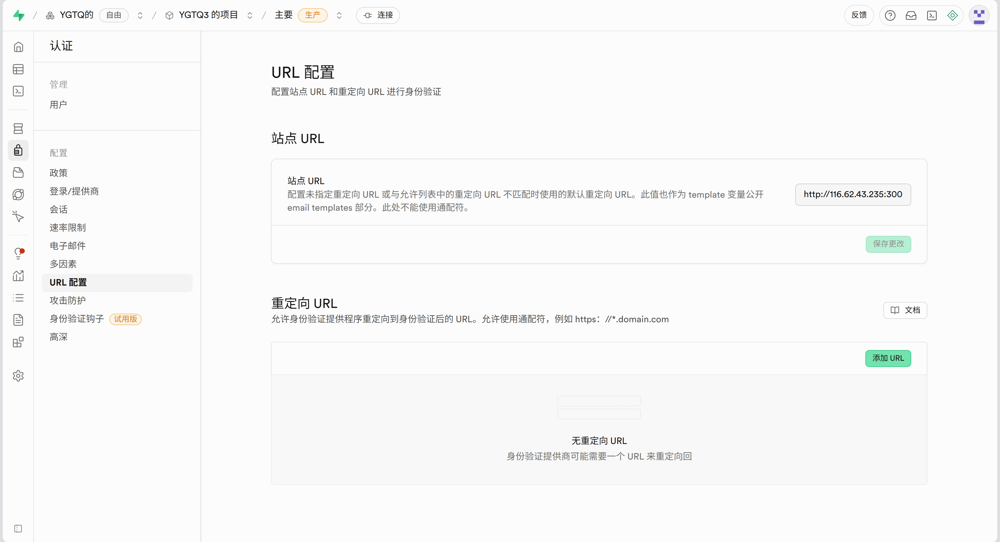

### 前端

基于node.js，pnpm实现

首先安装node.js和pnpm,这里使用了阿里云**Alibaba Cloud Linux 3**，且勾选了自动安装node.js 20版本，所以安装过程可直接省去。

#### 上传项目文件

```
进入文件目录
pnpm install
pnpm run dev
```

即可运行前端


```
pnpm install @supabase/supabase-js   #后端需要组件
```

---------------------

使用下面命令实现后台运行

```
nohup pnpm run dev > output.log 2>&1 &
```

关闭终端时要先，exit退出登录，再关闭终端


### 后端

现在是使用的Supabase做数据的存储

#### 数据库初始化sql脚本

```
-- 启用必要的扩展
CREATE EXTENSION IF NOT EXISTS "uuid-ossp";

-- 1. 用户表 (扩展 auth.users)
CREATE TABLE public.users (
  id UUID REFERENCES auth.users(id) ON DELETE CASCADE PRIMARY KEY,
  email TEXT UNIQUE NOT NULL,
  username TEXT UNIQUE NOT NULL,
  avatar_url TEXT,
  created_at TIMESTAMP WITH TIME ZONE DEFAULT NOW(),
  updated_at TIMESTAMP WITH TIME ZONE DEFAULT NOW()
);

-- 2. 学习任务表
CREATE TABLE public.learning_tasks (
  id UUID DEFAULT uuid_generate_v4() PRIMARY KEY,
  user_id UUID REFERENCES public.users(id) ON DELETE CASCADE NOT NULL,
  title TEXT NOT NULL,
  description TEXT,
  start_time TIME NOT NULL,
  end_time TIME NOT NULL,
  date DATE NOT NULL,
  completed BOOLEAN DEFAULT FALSE,
  category TEXT NOT NULL,
  priority TEXT CHECK (priority IN ('low', 'medium', 'high')) DEFAULT 'medium',
  created_at TIMESTAMP WITH TIME ZONE DEFAULT NOW(),
  updated_at TIMESTAMP WITH TIME ZONE DEFAULT NOW()
);

-- 3. 学习资源表
CREATE TABLE public.learning_resources (
  id UUID DEFAULT uuid_generate_v4() PRIMARY KEY,
  user_id UUID REFERENCES public.users(id) ON DELETE CASCADE NOT NULL,
  title TEXT NOT NULL,
  description TEXT,
  category TEXT NOT NULL,
  type TEXT CHECK (type IN ('video', 'document', 'audio', 'image', 'link')) DEFAULT 'document',
  url TEXT,
  file_url TEXT,
  tags TEXT[] DEFAULT '{}',
  rating DECIMAL(2,1) CHECK (rating >= 0 AND rating <= 5) DEFAULT 0,
  difficulty TEXT CHECK (difficulty IN ('beginner', 'intermediate', 'advanced')) DEFAULT 'beginner',
  duration INTEGER, -- 分钟
  size BIGINT, -- 字节
  uploaded_by UUID REFERENCES public.users(id),
  download_count INTEGER DEFAULT 0,
  is_favorite BOOLEAN DEFAULT FALSE,
  created_at TIMESTAMP WITH TIME ZONE DEFAULT NOW(),
  updated_at TIMESTAMP WITH TIME ZONE DEFAULT NOW()
);

-- 4. 用户设置表
CREATE TABLE public.user_settings (
  id UUID DEFAULT uuid_generate_v4() PRIMARY KEY,
  user_id UUID REFERENCES public.users(id) ON DELETE CASCADE UNIQUE NOT NULL,
  theme TEXT CHECK (theme IN ('light', 'dark', 'system')) DEFAULT 'light',
  notifications JSONB DEFAULT '{
    "enabled": false,
    "taskReminders": true,
    "dailyGoals": true,
    "studyBreaks": true,
    "reviewReminders": true
  }'::jsonb,
  timezone TEXT DEFAULT 'Asia/Shanghai',
  language TEXT DEFAULT 'zh-CN',
  created_at TIMESTAMP WITH TIME ZONE DEFAULT NOW(),
  updated_at TIMESTAMP WITH TIME ZONE DEFAULT NOW()
);

-- 5. 学习统计表
CREATE TABLE public.learning_stats (
  id UUID DEFAULT uuid_generate_v4() PRIMARY KEY,
  user_id UUID REFERENCES public.users(id) ON DELETE CASCADE NOT NULL,
  date DATE NOT NULL,
  total_study_time INTEGER DEFAULT 0, -- 分钟
  completed_tasks INTEGER DEFAULT 0,
  total_tasks INTEGER DEFAULT 0,
  categories_studied TEXT[] DEFAULT '{}',
  created_at TIMESTAMP WITH TIME ZONE DEFAULT NOW(),
  updated_at TIMESTAMP WITH TIME ZONE DEFAULT NOW(),
  UNIQUE(user_id, date)
);

-- 6. 设备管理表
CREATE TABLE public.user_devices (
  id UUID DEFAULT uuid_generate_v4() PRIMARY KEY,
  user_id UUID REFERENCES public.users(id) ON DELETE CASCADE NOT NULL,
  device_name TEXT NOT NULL,
  device_type TEXT CHECK (device_type IN ('desktop', 'mobile', 'tablet')) DEFAULT 'desktop',
  device_id TEXT NOT NULL, -- 浏览器指纹或设备唯一标识
  user_agent TEXT,
  ip_address INET,
  last_active TIMESTAMP WITH TIME ZONE DEFAULT NOW(),
  is_current BOOLEAN DEFAULT FALSE,
  created_at TIMESTAMP WITH TIME ZONE DEFAULT NOW(),
  UNIQUE(user_id, device_id)
);

-- 7. 同步日志表 (用于调试和监控)
CREATE TABLE public.sync_logs (
  id UUID DEFAULT uuid_generate_v4() PRIMARY KEY,
  user_id UUID REFERENCES public.users(id) ON DELETE CASCADE NOT NULL,
  device_id UUID REFERENCES public.user_devices(id) ON DELETE SET NULL,
  sync_type TEXT NOT NULL, -- 'full', 'incremental', 'conflict_resolution'
  table_name TEXT NOT NULL,
  operation TEXT CHECK (operation IN ('insert', 'update', 'delete', 'conflict')) NOT NULL,
  record_id UUID,
  status TEXT CHECK (status IN ('success', 'error', 'conflict')) DEFAULT 'success',
  error_message TEXT,
  sync_duration INTEGER, -- 毫秒
  created_at TIMESTAMP WITH TIME ZONE DEFAULT NOW()
);

-- 创建索引以提高查询性能
CREATE INDEX idx_learning_tasks_user_date ON public.learning_tasks(user_id, date);
CREATE INDEX idx_learning_tasks_category ON public.learning_tasks(category);
CREATE INDEX idx_learning_resources_user_category ON public.learning_resources(user_id, category);
CREATE INDEX idx_learning_resources_tags ON public.learning_resources USING GIN(tags);
CREATE INDEX idx_learning_stats_user_date ON public.learning_stats(user_id, date);
CREATE INDEX idx_user_devices_user_active ON public.user_devices(user_id, last_active);
CREATE INDEX idx_sync_logs_user_created ON public.sync_logs(user_id, created_at);

-- 创建更新时间触发器函数
CREATE OR REPLACE FUNCTION update_updated_at_column()
RETURNS TRIGGER AS $$
BEGIN
  NEW.updated_at = NOW();
  RETURN NEW;
END;
$$ language 'plpgsql';

-- 为所有表添加更新时间触发器
CREATE TRIGGER update_users_updated_at BEFORE UPDATE ON public.users
  FOR EACH ROW EXECUTE FUNCTION update_updated_at_column();

CREATE TRIGGER update_learning_tasks_updated_at BEFORE UPDATE ON public.learning_tasks
  FOR EACH ROW EXECUTE FUNCTION update_updated_at_column();

CREATE TRIGGER update_learning_resources_updated_at BEFORE UPDATE ON public.learning_resources
  FOR EACH ROW EXECUTE FUNCTION update_updated_at_column();

CREATE TRIGGER update_user_settings_updated_at BEFORE UPDATE ON public.user_settings
  FOR EACH ROW EXECUTE FUNCTION update_updated_at_column();

CREATE TRIGGER update_learning_stats_updated_at BEFORE UPDATE ON public.learning_stats
  FOR EACH ROW EXECUTE FUNCTION update_updated_at_column();
```

```
-- 启用所有表的 RLS
ALTER TABLE public.users ENABLE ROW LEVEL SECURITY;
ALTER TABLE public.learning_tasks ENABLE ROW LEVEL SECURITY;
ALTER TABLE public.learning_resources ENABLE ROW LEVEL SECURITY;
ALTER TABLE public.user_settings ENABLE ROW LEVEL SECURITY;
ALTER TABLE public.learning_stats ENABLE ROW LEVEL SECURITY;
ALTER TABLE public.user_devices ENABLE ROW LEVEL SECURITY;
ALTER TABLE public.sync_logs ENABLE ROW LEVEL SECURITY;

-- ================================
-- 用户表策略
-- ================================

-- 用户只能查看自己的信息
CREATE POLICY "Users can view own profile" ON public.users
  FOR SELECT USING (auth.uid() = id);

-- 用户可以更新自己的信息
CREATE POLICY "Users can update own profile" ON public.users
  FOR UPDATE USING (auth.uid() = id);

-- 用户注册时可以插入自己的信息
CREATE POLICY "Users can insert own profile" ON public.users
  FOR INSERT WITH CHECK (auth.uid() = id);

-- ================================
-- 学习任务表策略
-- ================================

-- 用户只能查看自己的任务
CREATE POLICY "Users can view own tasks" ON public.learning_tasks
  FOR SELECT USING (auth.uid() = user_id);

-- 用户可以创建自己的任务
CREATE POLICY "Users can create own tasks" ON public.learning_tasks
  FOR INSERT WITH CHECK (auth.uid() = user_id);

-- 用户可以更新自己的任务
CREATE POLICY "Users can update own tasks" ON public.learning_tasks
  FOR UPDATE USING (auth.uid() = user_id);

-- 用户可以删除自己的任务
CREATE POLICY "Users can delete own tasks" ON public.learning_tasks
  FOR DELETE USING (auth.uid() = user_id);

-- ================================
-- 学习资源表策略
-- ================================

-- 用户可以查看自己的资源
CREATE POLICY "Users can view own resources" ON public.learning_resources
  FOR SELECT USING (auth.uid() = user_id);

-- 用户可以创建自己的资源
CREATE POLICY "Users can create own resources" ON public.learning_resources
  FOR INSERT WITH CHECK (auth.uid() = user_id);

-- 用户可以更新自己的资源
CREATE POLICY "Users can update own resources" ON public.learning_resources
  FOR UPDATE USING (auth.uid() = user_id);

-- 用户可以删除自己的资源
CREATE POLICY "Users can delete own resources" ON public.learning_resources
  FOR DELETE USING (auth.uid() = user_id);

-- ================================
-- 用户设置表策略
-- ================================

-- 用户只能查看自己的设置
CREATE POLICY "Users can view own settings" ON public.user_settings
  FOR SELECT USING (auth.uid() = user_id);

-- 用户可以创建自己的设置
CREATE POLICY "Users can create own settings" ON public.user_settings
  FOR INSERT WITH CHECK (auth.uid() = user_id);

-- 用户可以更新自己的设置
CREATE POLICY "Users can update own settings" ON public.user_settings
  FOR UPDATE USING (auth.uid() = user_id);

-- ================================
-- 学习统计表策略
-- ================================

-- 用户只能查看自己的统计
CREATE POLICY "Users can view own stats" ON public.learning_stats
  FOR SELECT USING (auth.uid() = user_id);

-- 用户可以创建自己的统计
CREATE POLICY "Users can create own stats" ON public.learning_stats
  FOR INSERT WITH CHECK (auth.uid() = user_id);

-- 用户可以更新自己的统计
CREATE POLICY "Users can update own stats" ON public.learning_stats
  FOR UPDATE USING (auth.uid() = user_id);

-- ================================
-- 设备管理表策略
-- ================================

-- 用户只能查看自己的设备
CREATE POLICY "Users can view own devices" ON public.user_devices
  FOR SELECT USING (auth.uid() = user_id);

-- 用户可以注册自己的设备
CREATE POLICY "Users can register own devices" ON public.user_devices
  FOR INSERT WITH CHECK (auth.uid() = user_id);

-- 用户可以更新自己的设备信息
CREATE POLICY "Users can update own devices" ON public.user_devices
  FOR UPDATE USING (auth.uid() = user_id);

-- 用户可以删除自己的设备
CREATE POLICY "Users can delete own devices" ON public.user_devices
  FOR DELETE USING (auth.uid() = user_id);

-- ================================
-- 同步日志表策略
-- ================================

-- 用户只能查看自己的同步日志
CREATE POLICY "Users can view own sync logs" ON public.sync_logs
  FOR SELECT USING (auth.uid() = user_id);

-- 系统可以创建同步日志
CREATE POLICY "System can create sync logs" ON public.sync_logs
  FOR INSERT WITH CHECK (auth.uid() = user_id);
```

```
-- ================================
-- 自动创建用户资料函数
-- ================================

CREATE OR REPLACE FUNCTION public.handle_new_user()
RETURNS TRIGGER AS $$
BEGIN
  INSERT INTO public.users (id, email, username)
  VALUES (
    NEW.id,
    NEW.email,
    COALESCE(NEW.raw_user_meta_data->>'username', split_part(NEW.email, '@', 1))
  );
  
  -- 创建默认设置
  INSERT INTO public.user_settings (user_id)
  VALUES (NEW.id);
  
  RETURN NEW;
END;
$$ LANGUAGE plpgsql SECURITY DEFINER;

-- 当新用户注册时自动创建资料
CREATE TRIGGER on_auth_user_created
  AFTER INSERT ON auth.users
  FOR EACH ROW EXECUTE FUNCTION public.handle_new_user();

-- ================================
-- 更新学习统计函数
-- ================================

CREATE OR REPLACE FUNCTION public.update_learning_stats()
RETURNS TRIGGER AS $$
DECLARE
  task_date DATE;
  study_duration INTEGER;
BEGIN
  -- 获取任务日期
  IF TG_OP = 'DELETE' THEN
    task_date := OLD.date;
  ELSE
    task_date := NEW.date;
  END IF;

  -- 计算学习时长（分钟）
  IF TG_OP = 'DELETE' THEN
    study_duration := EXTRACT(EPOCH FROM (OLD.end_time - OLD.start_time)) / 60;
  ELSE
    study_duration := EXTRACT(EPOCH FROM (NEW.end_time - NEW.start_time)) / 60;
  END IF;

  -- 更新或插入统计数据
  INSERT INTO public.learning_stats (user_id, date, total_study_time, completed_tasks, total_tasks, categories_studied)
  VALUES (
    COALESCE(NEW.user_id, OLD.user_id),
    task_date,
    CASE 
      WHEN TG_OP = 'DELETE' THEN -study_duration
      WHEN TG_OP = 'INSERT' THEN study_duration
      WHEN TG_OP = 'UPDATE' AND NEW.completed != OLD.completed THEN 0
      ELSE study_duration - EXTRACT(EPOCH FROM (OLD.end_time - OLD.start_time)) / 60
    END,
    CASE 
      WHEN TG_OP = 'DELETE' AND OLD.completed THEN -1
      WHEN TG_OP = 'INSERT' AND NEW.completed THEN 1
      WHEN TG_OP = 'UPDATE' AND NEW.completed != OLD.completed THEN 
        CASE WHEN NEW.completed THEN 1 ELSE -1 END
      ELSE 0
    END,
    CASE 
      WHEN TG_OP = 'DELETE' THEN -1
      WHEN TG_OP = 'INSERT' THEN 1
      ELSE 0
    END,
    ARRAY[COALESCE(NEW.category, OLD.category)]
  )
  ON CONFLICT (user_id, date) 
  DO UPDATE SET
    total_study_time = learning_stats.total_study_time + EXCLUDED.total_study_time,
    completed_tasks = learning_stats.completed_tasks + EXCLUDED.completed_tasks,
    total_tasks = learning_stats.total_tasks + EXCLUDED.total_tasks,
    categories_studied = array_cat(learning_stats.categories_studied, EXCLUDED.categories_studied),
    updated_at = NOW();

  RETURN COALESCE(NEW, OLD);
END;
$$ LANGUAGE plpgsql;

-- 任务变化时更新统计
CREATE TRIGGER update_stats_on_task_change
  AFTER INSERT OR UPDATE OR DELETE ON public.learning_tasks
  FOR EACH ROW EXECUTE FUNCTION public.update_learning_stats();

-- ================================
-- 设备管理函数
-- ================================

CREATE OR REPLACE FUNCTION public.register_device(
  device_name TEXT,
  device_type TEXT DEFAULT 'desktop',
  device_id TEXT DEFAULT NULL,
  user_agent TEXT DEFAULT NULL
)
RETURNS UUID AS $$
DECLARE
  new_device_id UUID;
  current_user_id UUID;
BEGIN
  current_user_id := auth.uid();
  
  IF current_user_id IS NULL THEN
    RAISE EXCEPTION 'User not authenticated';
  END IF;

  -- 生成设备ID（如果未提供）
  IF device_id IS NULL THEN
    device_id := gen_random_uuid()::TEXT;
  END IF;

  -- 将其他设备设为非当前设备
  UPDATE public.user_devices 
  SET is_current = FALSE 
  WHERE user_id = current_user_id;

  -- 插入或更新设备信息
  INSERT INTO public.user_devices (
    user_id, 
    device_name, 
    device_type, 
    device_id, 
    user_agent, 
    ip_address,
    is_current,
    last_active
  )
  VALUES (
    current_user_id,
    device_name,
    device_type,
    device_id,
    user_agent,
    inet_client_addr(),
    TRUE,
    NOW()
  )
  ON CONFLICT (user_id, device_id)
  DO UPDATE SET
    device_name = EXCLUDED.device_name,
    device_type = EXCLUDED.device_type,
    user_agent = EXCLUDED.user_agent,
    ip_address = EXCLUDED.ip_address,
    is_current = TRUE,
    last_active = NOW()
  RETURNING id INTO new_device_id;

  RETURN new_device_id;
END;
$$ LANGUAGE plpgsql SECURITY DEFINER;

-- ================================
-- 同步日志函数
-- ================================

CREATE OR REPLACE FUNCTION public.log_sync_operation(
  sync_type TEXT,
  table_name TEXT,
  operation TEXT,
  record_id UUID DEFAULT NULL,
  status TEXT DEFAULT 'success',
  error_message TEXT DEFAULT NULL,
  sync_duration INTEGER DEFAULT NULL
)
RETURNS UUID AS $$
DECLARE
  log_id UUID;
  current_user_id UUID;
  current_device_id UUID;
BEGIN
  current_user_id := auth.uid();
  
  IF current_user_id IS NULL THEN
    RAISE EXCEPTION 'User not authenticated';
  END IF;

  -- 获取当前设备ID
  SELECT id INTO current_device_id
  FROM public.user_devices
  WHERE user_id = current_user_id AND is_current = TRUE
  LIMIT 1;

  INSERT INTO public.sync_logs (
    user_id,
    device_id,
    sync_type,
    table_name,
    operation,
    record_id,
    status,
    error_message,
    sync_duration
  )
  VALUES (
    current_user_id,
    current_device_id,
    sync_type,
    table_name,
    operation,
    record_id,
    status,
    error_message,
    sync_duration
  )
  RETURNING id INTO log_id;

  RETURN log_id;
END;
$$ LANGUAGE plpgsql SECURITY DEFINER;
```

```
-- ================================
-- 插入示例分类数据
-- ================================

-- 创建分类表（可选，用于标准化分类）
CREATE TABLE IF NOT EXISTS public.categories (
  id UUID DEFAULT uuid_generate_v4() PRIMARY KEY,
  name TEXT UNIQUE NOT NULL,
  icon TEXT,
  color TEXT,
  description TEXT,
  is_system BOOLEAN DEFAULT TRUE,
  created_at TIMESTAMP WITH TIME ZONE DEFAULT NOW()
);

-- 插入默认分类
INSERT INTO public.categories (name, icon, color, description) VALUES
  ('数学', 'fa-calculator', '#3B82F6', '数学相关学习内容'),
  ('物理', 'fa-atom', '#10B981', '物理学科学习资源'),
  ('英语', 'fa-language', '#F59E0B', '英语语言学习'),
  ('编程', 'fa-code', '#8B5CF6', '编程技术学习'),
  ('历史', 'fa-landmark', '#EF4444', '历史文化学习'),
  ('生物', 'fa-dna', '#06B6D4', '生物科学学习'),
  ('化学', 'fa-flask', '#84CC16', '化学实验学习'),
  ('文学', 'fa-book-open', '#F97316', '文学作品阅读'),
  ('艺术', 'fa-palette', '#EC4899', '艺术创作学习'),
  ('音乐', 'fa-music', '#6366F1', '音乐理论实践');

-- 为分类表启用 RLS
ALTER TABLE public.categories ENABLE ROW LEVEL SECURITY;

-- 所有用户都可以查看分类
CREATE POLICY "Everyone can view categories" ON public.categories
  FOR SELECT USING (true);

-- ================================
-- 创建视图用于数据分析
-- ================================

-- 用户学习概览视图
CREATE OR REPLACE VIEW public.user_learning_overview AS
SELECT 
  u.id as user_id,
  u.username,
  u.email,
  COUNT(DISTINCT lt.id) as total_tasks,
  COUNT(DISTINCT CASE WHEN lt.completed THEN lt.id END) as completed_tasks,
  COUNT(DISTINCT lr.id) as total_resources,
  COUNT(DISTINCT lt.category) as categories_count,
  COALESCE(SUM(EXTRACT(EPOCH FROM (lt.end_time - lt.start_time)) / 60), 0) as total_study_minutes,
  MAX(lt.created_at) as last_task_created,
  MAX(lr.created_at) as last_resource_added
FROM public.users u
LEFT JOIN public.learning_tasks lt ON u.id = lt.user_id
LEFT JOIN public.learning_resources lr ON u.id = lr.user_id
GROUP BY u.id, u.username, u.email;

-- 每日学习统计视图
CREATE OR REPLACE VIEW public.daily_learning_stats AS
SELECT 
  ls.*,
  u.username,
  ROUND((ls.completed_tasks::DECIMAL / NULLIF(ls.total_tasks, 0)) * 100, 2) as completion_rate
FROM public.learning_stats ls
JOIN public.users u ON ls.user_id = u.id
ORDER BY ls.date DESC;

-- 热门分类视图
CREATE OR REPLACE VIEW public.popular_categories AS
SELECT 
  category,
  COUNT(*) as task_count,
  COUNT(DISTINCT user_id) as user_count,
  AVG(EXTRACT(EPOCH FROM (end_time - start_time)) / 60) as avg_duration_minutes
FROM public.learning_tasks
GROUP BY category
ORDER BY task_count DESC;
```

```
-- 删除现有策略（如果有）
DROP POLICY IF EXISTS "Users can view own profile" ON users;
DROP POLICY IF EXISTS "Users can insert own profile" ON users;
DROP POLICY IF EXISTS "Users can update own profile" ON users;
DROP POLICY IF EXISTS "Users can delete own profile" ON users;

-- 1. 允许认证用户查看自己的资料
CREATE POLICY "Users can view own profile" ON users
FOR SELECT TO authenticated
USING (auth.uid() = id);

-- 2. 允许认证用户插入自己的资料
CREATE POLICY "Users can insert own profile" ON users
FOR INSERT TO authenticated
WITH CHECK (auth.uid() = id);

-- 3. 允许认证用户更新自己的资料
CREATE POLICY "Users can update own profile" ON users
FOR UPDATE TO authenticated
USING (auth.uid() = id)
WITH CHECK (auth.uid() = id);

-- 4. 允许认证用户删除自己的资料
CREATE POLICY "Users can delete own profile" ON users
FOR DELETE TO authenticated
USING (auth.uid() = id);
```

```
-- 删除现有策略（如果有）
DROP POLICY IF EXISTS "Users can view own settings" ON user_settings;
DROP POLICY IF EXISTS "Users can insert own settings" ON user_settings;
DROP POLICY IF EXISTS "Users can update own settings" ON user_settings;
DROP POLICY IF EXISTS "Users can delete own settings" ON user_settings;

-- 1. 允许认证用户查看自己的设置
CREATE POLICY "Users can view own settings" ON user_settings
FOR SELECT TO authenticated
USING (auth.uid() = user_id);

-- 2. 允许认证用户插入自己的设置
CREATE POLICY "Users can insert own settings" ON user_settings
FOR INSERT TO authenticated
WITH CHECK (auth.uid() = user_id);

-- 3. 允许认证用户更新自己的设置
CREATE POLICY "Users can update own settings" ON user_settings
FOR UPDATE TO authenticated
USING (auth.uid() = user_id)
WITH CHECK (auth.uid() = user_id);

-- 4. 允许认证用户删除自己的设置
CREATE POLICY "Users can delete own settings" ON user_settings
FOR DELETE TO authenticated
USING (auth.uid() = user_id);
```

```
-- 创建一个安全的用户创建函数
CREATE OR REPLACE FUNCTION create_user_profile(
  user_id UUID,
  user_email TEXT,
  user_name TEXT
)
RETURNS void
LANGUAGE plpgsql
SECURITY DEFINER
AS $$
BEGIN
  INSERT INTO users (id, email, username)
  VALUES (user_id, user_email, user_name)
  ON CONFLICT (id) DO UPDATE SET
    email = EXCLUDED.email,
    username = EXCLUDED.username,
    updated_at = NOW();
END;
$$;

-- 授权给认证用户使用
GRANT EXECUTE ON FUNCTION create_user_profile TO authenticated, anon;
```

#### 完成数据库初始化后

在项目上方有 connect，点击后选择应用程序架构，将.env.local内容复制到前端代码中的.env.local

但要注意前端代码中的名称和给的名称不同，不要改



还需一步配置




Authentication中，URL配置，站点URL，配置成前端页面的链接

这样收到验证邮件后点击链接即可跳转到前端页面实现登录


